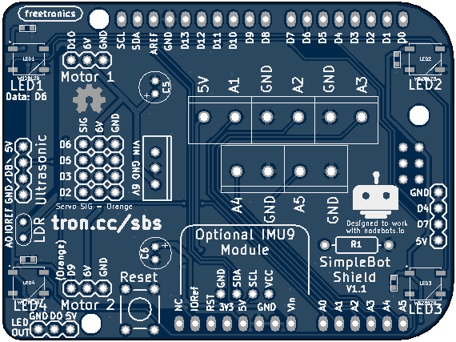

# SimpleBot Shield

This breakout shield for a wheeled robot was created to work with
@ajfisher's [SimpleBot R3](https://github.com/nodebotsau/simplebot)
design, as used for [NodeBots](http://nodebots.io) days here in Australia.

Originally designed for assembly at [LCA 2015 Open Hardware MiniConf](http://www.openhardwareconf.org/index.php/Main_Page).

# The shield provides for:

* 6 hobby servo connections, included 2 marked motor connections.
* Onboard 6V linear regulator for servo power.
* "SR04" Ultrasonic rangefinder mount.
* Light Dependent Resistor for communications, ambient light sensing.
* 4 WS2812B "NeoPixels" mounted in corners of the board.
* Screw terminal connections for 5 analog pins, power & ground.
* Additional header for 2 more digital pins, power & ground.
* Dedicated footprint area for [Freetronics IMU9](http://www.freetronics.com/products/9-dof-imu-accelerometer-gyroscope-magnetometer) accelerometer, gyroscope, magnetometer module.

# Resources

* Home page (coming soon)
* [Schematic PDF](https://raw.githubusercontent.com/freetronics/simplebot_shield/master/simplebot_shield_schematic.pdf)
